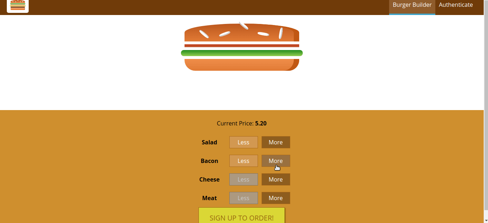

# Burger Builder With React

An Udemy Course Practice App Build With React Which Includes React, Redux, React Router, Firebase.

This project was bootstrapped with [Create React App](https://github.com/facebook/create-react-app).

## Codebase types

1. [With React Lifecycle (class based)](https://github.com/shindesharad71/Burger-Builder-With-React)
2. [With React Hooks](https://github.com/shindesharad71/Burger-Builder-With-React/tree/hooks)

## Demo

## Installation and Setup Instructions

Clone this repository or download.

-   Install project dependencies by running `npm i`
-   Run project locally by running `npm start`
-   Open `http://localhost:3000/` in the browser

### Thanks and Credits

1. [React - The Complete Guide](https://www.udemy.com/course/react-the-complete-guide-incl-redux/)
